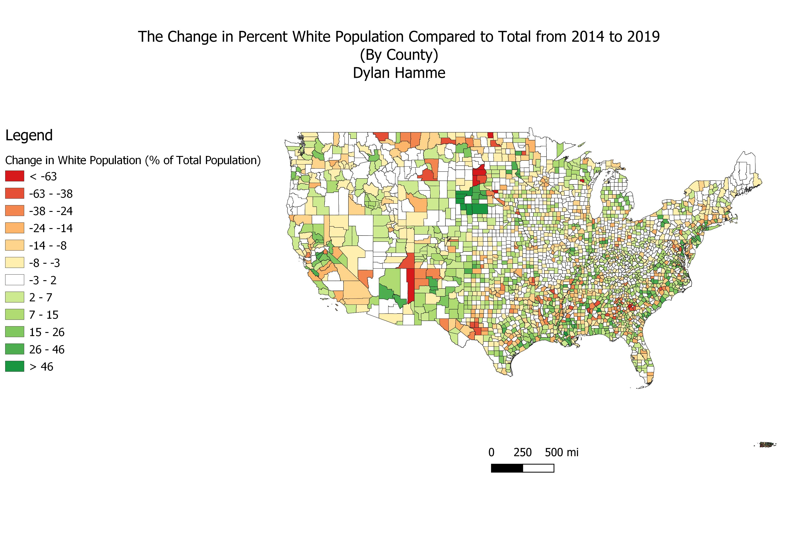

# A Comparison of the Change in Percent Population by Race in the United States Over a 5 Year Period
## *Dylan Hamme, 2021*

 

## Part 1:

 

**Overview:**

Working with census dats is one of the most common and useful practices in GIS. Here, I take open source data from the ACS to make a visual analysis of the change in the white population as a percent of the total between 2014 and 2019.
 
 
**Downloading Data:**

The first step to working with census data is downloading it. This was completed using R using tidyverse and tidycensus. The .Rmd is provided below:
 
<a href="Content/Lab_6_Census_R.Rmd">R Markdown<a/>
 
To quickly explain these steps: 
* The necessary libraries are called
* Settings are set for "tidycensus" and api key is provided
* Ideas are listed, and data is downloaded after deciding on analysis
* Data is transformed into WGS 84
* Variables are turned into percentages of total to make data more easily assesed
* The two different data sets are combined, and the difference in variables across time is calculated
* Data is written into the correct format
 

**Result**

The data could then directly be put into a spatial form using QGIS and an analysis of the change in the percent white population between 2014 and 2019.
<a href="Content/change_over_time.jpg"><a/>
 
 
  
## Part 2:

 

**Overview**
Next, using the same census data, I created an analysis of the change in the percent of Black and Asian populations across the country. This required the creation of a bivariate map, that is, a map that shows the 
