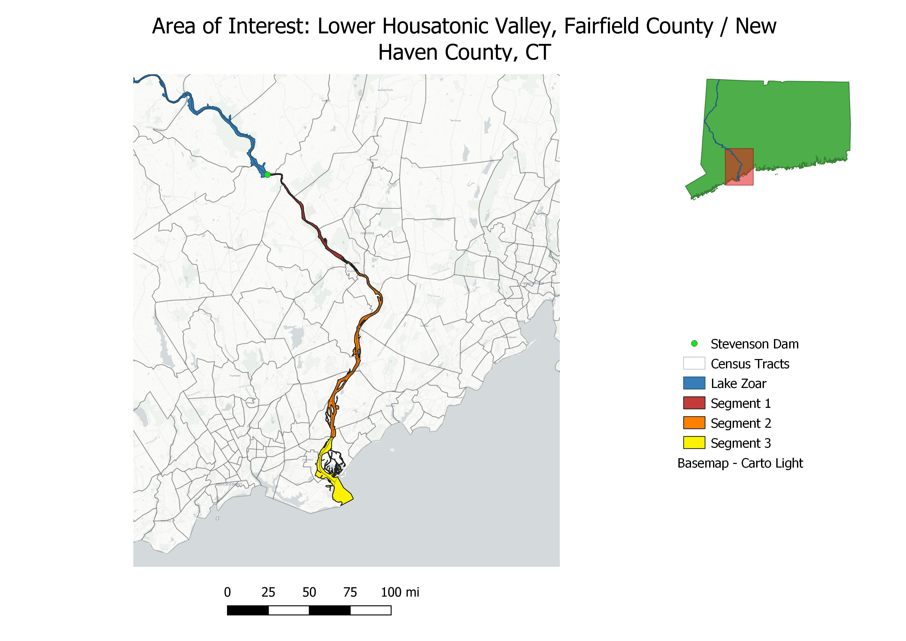
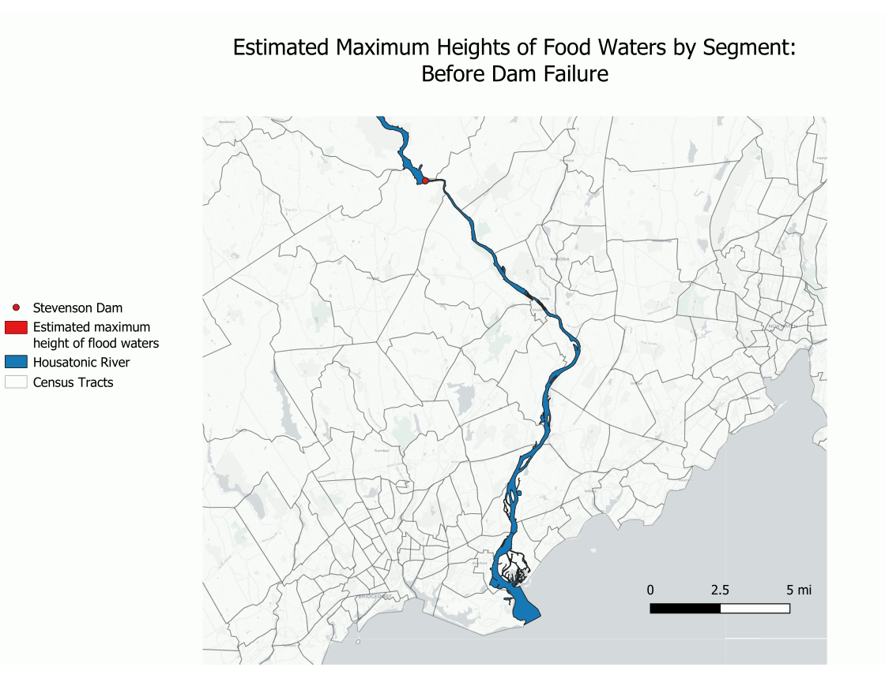
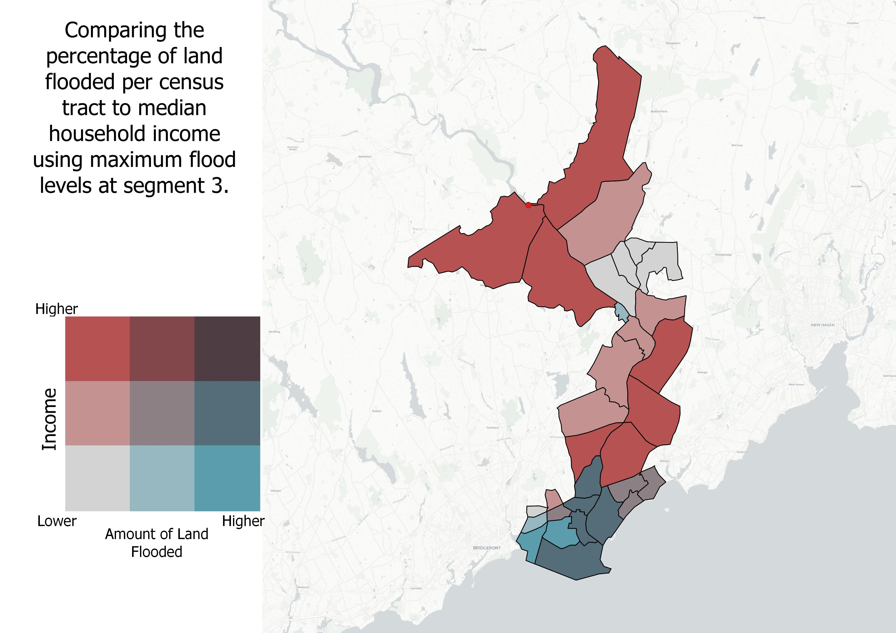

# A Representation of the Effects of Total Failure of the Stevenson Dam
## *Dylan Hamme, 2021*

***Introduction:***
 
With the frequency and intensity of summer storms increasing due to a rise in global temperature, the stress put on dams around the world is increasing. Many U.S. dams are relatively old, with many being over a century old since initially being built. Concerns of failure of these often neglected dams has been rising in recent years with the expectancy of increased stresses caused by rising global temperatures. The Stevenson Dam on the Housatonic River in Western Connecticut is no exception. The dam was originally built in 1917 with a power-house to accommodate the turbine used for energy production. Repairs and upgrades have been made throughout the century, specifically in 1936, 1951, 1958, 1995, and 1999. A recent article by Heather Mongilio brought the dangers of dated dams to my attention as she states “failures have occurred in every state, with at least 173 failures between 2005 and 2013… Approximately 15,500 of (U.S. Dams) are classified as high hazard, meaning in the case of failure, at least one life could be lost”.
 
 
 
***Overview:***
 
This is a display of a the simulated effects on the Lower Housatonic Valley after a theoretical total failure of the Stevenson Dam on the Housatonic River. The Dam creates Lake Zoar, a Lake with 27 Miles of shoreline. An analysis of the effects of dam failure include calculating the maximum water levels downriver after the event, and looking at the statistics of what demographics will be effected and where.
 
 
 
***Calculations:***
 
The height of flood waters is a function of time after the initial release of water. To simulate this, the Lower Housatonic River was broken into three segments as to show what the height of the water may be as the flood waters reach each "checkpoint", or the end of each segment. These segments are labeled simply as "Segment 1", "Segment 2", and "Segment 3". The segments were simply chosen using the segmentation of the river according the the shapefile used as the representation. 
 
<a href="Files/RiverOverview.jpg"><a/>
 
 
 
In order to calculate the height of water at each segment, a series of calculations were made using the estimated amount of water held behind Lake Zoar at any given time.
 
 
	Segment 1: This segment is about 30,000 ft long, and Lake Zoar holds about (avg. depth is 29 feet with a surface area of 909 acres (3.96 *10^7 sq. ft.)) 1.1484 * 10^9 cb. ft. of water, meaning that the max amount of water height added to the surface would be (segment has an area of 346 acres so 1.1484 * 10^9 cb. ft./ 1.507 *10 ^7 sq. ft.) about 76 ft of additional water. This does not take into account the cross sectional area of the river valley, so height will be adjusted on a relative basis. 
 
 
	Segment 2: Because the released water will not move down the river as a singular blob, segment 2 consists of the length of segment 1 and segment 2, which is about 85,000 ft long, and has a total acreage of (346 + 1041 = 1392) which is equivalent to 6.0636 * 10^7 sq. ft. This means the total additional water level would be 19 ft.
 
 
	Segment 3: An additional 25,000 ft of river is left before entering long island sound, this segment has a surface area of 1021 acres (total of 2413 acres or 1.0511 * 10^8 sq. ft.), this is equivalent to an extra 11 ft.
 
 
	In order to take into the account of the parabolic cross sectional area of the river valley, these estimates will be cut in half to make a more sound estimate of water elevation at each section of the river with respect to time. At the end of segment 1, the water level will be at 38 ft higher than the initial water level, at the end of segment 2, the water is about 9ft higher than the initial level, and as the river reaches long island sound, the water level is about 5ft higher than the initial water level. 
 
 
 
***Turning Numbers into a Display:***
 
The next part of the analysis is the visual aspect. This begins with some data taken from open source websites (listed at the bottom of this page). These include a shapefile of one foot contours of the Lower Housatonic Valley, a shapefile of the current water levels of the river, a shapefile of the census tracts of Fairfield County and New Haven County that include data for the median household income of each tract, and a shapefile of the state of Connecticut.
 
The steps to create a display are generalized below:
 
- Create a buffer around the river that encapsulates the contours that may be affected by flooding (10000 ft).
- Use the extraction tool to select the contours of the valley. Use the select by attribute function to select only the contours of the appropriate calculated water level. To make this into a polygon, only the maximum elevation contours were selected, then the polygonize function was used after editing the contours to make an enclosed shape that represents the land covered by flood waters.
- Download ACS data on Fairfield and New Haven Counties for median household income.
- Use the extract tool to find which tracts will be affected by the flood waters.
 
	<a href="Files/FloodPattern.gif"><a/>
 
 
 
***Comparing Flooded Area to Demographics***
 
Using the flood data calculated for Segment 3, the percentage of land flooded in each census tract was compared to the median household income of each tract. The steps to doing so are listed below:
 
- Use the field calculator to find the area of each tract.
- Use the difference tool to remove the flooded area from each tract.
- Create a new field that finds the adjusted area of the tract, representing the amount of land untouched by waters.
- Create a third field that will represent the percent of land flooded in each tract. (100 - ((Adjusted area / total area)*100)).
- The attribute tables of these shapefiles were then joined with the census shapefile containing the median household income values using the GEOID field.
- Bivariate maps were then created using the median household income values as well as the percentage of land covered by flood waters.
 
<a href="Files/Bivariate.jpg"><a/>
