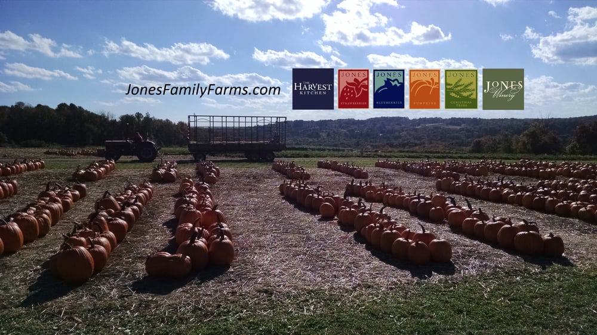

## An Analysis of the Environmental Impacts and Occurrences within Jones Family Farms: A Landscape Perspective

***Description:***
This is a brief report that focuses on the ecological factors and their influences from a landscape perspective within the 
boundaries of Jones Family Farms located in Shelton, Connecticut.

<a href="pdf/Landscape Report.pdf">Click to see full report</a>.

***Tools Used:***
Google Maps, ARCPro

