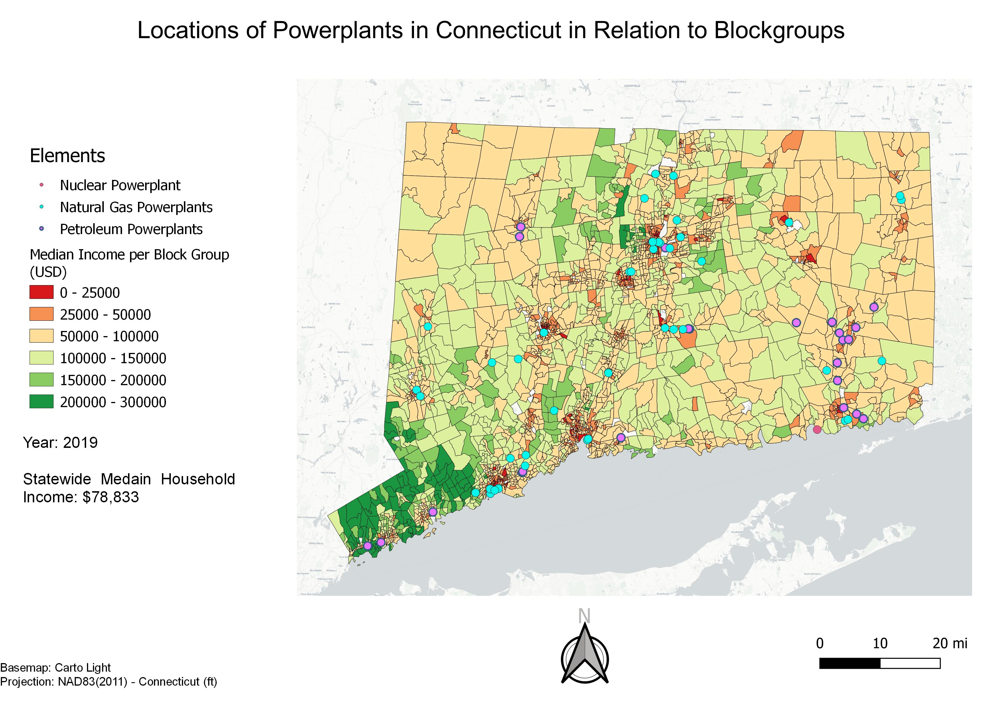
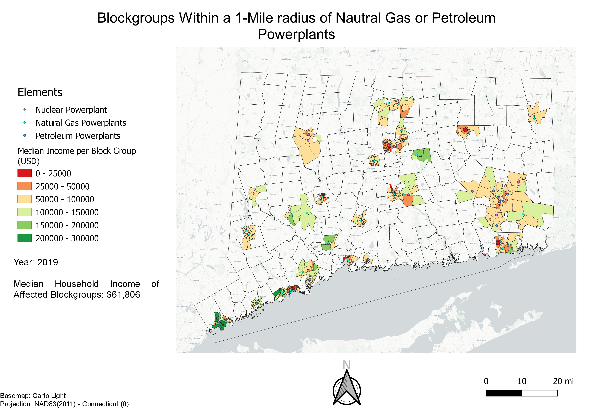
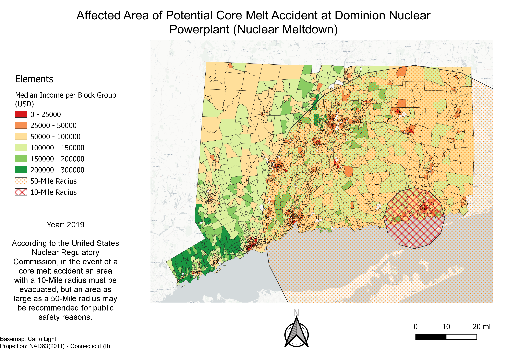
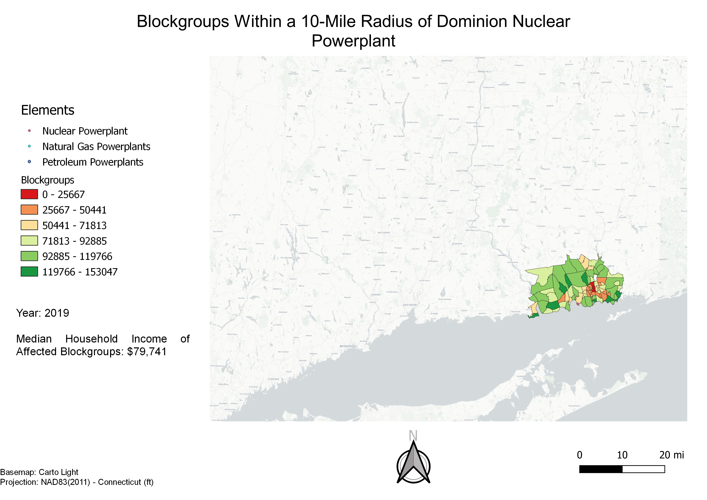

## What Are the Dangers of Powerplants and Whom Do They Affect?

***Introduction:*** 
The dangers of different kinds of powerplants has been of topic of research for a few decades. It is known that some release contaminants into the atmosphere through the burning of fuels like petroleum and natural gas, and research has also shown patterns that these are routinely placed in areas of poverty. This is  tested using public survey data compared to the locations of different types of powerplants across Connecticut. 
 
 
 
**Overview:**
This is purely a display of the data that will be used to make an analysis: powerplant types and locations and median household incomes of each available blockgroup in Connecticut. The statewide median household income is provided for comparison to future data.
 

 
 
 
**Placement Relative to Income:**
There is no clear data based on research that looks at how far reaching the potential hazards of air contaminants from fuel powerplants are, but this is a necassary aspect of deciding which blockgroups are affected by powerplants. To get an approximate estimate of the affected area, a zone of a one mile radius was placed around every natural gas or petroleum burning plant and everyblock group that fell inside of the one mile zone was considered affected. The data for every blockgroup was then collected and the median household income of the affected blockgroups was calculated. This can be compared to the statewide median.
 

 
 
 
**What About the Nuclear Plant?:**
The Dominion Nuclear Powerplant is the only nuclear powerplant in Connecticut, but is responsible for more than half of the state's total energy production. Nuclear powerplants do not release toxins into the atmoshpere like the previous powerplants, instead they endanger the surrounding area through the threat of a core melt accident, or a nuclear meltdown. In the case of this occurring, the United States Nuclear Regulatory Commission states that an area with a radius of at least ten miles will be evacuated due to the threat of radiation poisoning, and depending on the severity of the accident, an area as large as a fiftey mile radius may be considered unsafe.
 

 
 
 
**Whom will this affect:**
In the case of the smallest core melt accident, the blockgroups within the ten mile radius area will be evacuated, but this looks different than the areas that are affected by the petroleum and natural gas powerplants.
 

 
 
 
***Analysis:***
